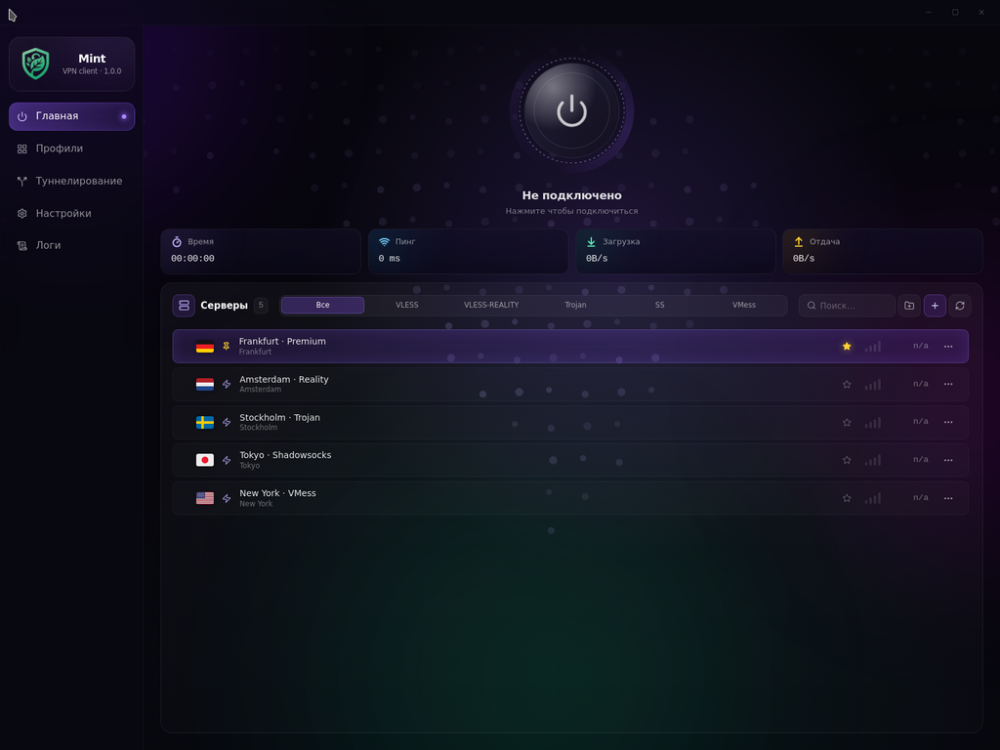

<div align="center">

<br>


# Mint VPN

**A modern, polished VPN desktop client for Windows.**
<br>
<sub>Tauri 2 · React 19 · sing-box</sub>

<br>

[](https://github.com/M1ntVPN/mint/actions/workflows/build.yml)
[](https://tauri.app)
[](https://react.dev)
[](#installation)
[](#license)

<br>



<br>

</div>

---

## ✨ Features

|   | |
|---|---|
| 🚀 | **Native Windows desktop client** — frameless dark UI, system tray, autostart |
| 🛡️ | **Real VPN core** — bundles [sing-box](https://github.com/SagerNet/sing-box). Supports **VLESS · VMess · Trojan · Shadowsocks · Reality** |
| 🧩 | **Split-tunneling** — pick installed apps or live processes; per-app, per-folder, per-CIDR rules |
| 🔒 | **Killswitch** — Windows Firewall blocks all egress unless it goes through sing-box |
| 📥 | **Subscription import** — share-URI lists, base64 blobs, Clash YAML, sing-box JSON |
| 🎨 | **Polished UX** — iOS-style fold animations, live RTT ping, traffic quota bar, multi-hop |

<br>

## 📦 Installation

Download the latest **`Mint VPN_<version>_x64-setup.exe`** from the latest [CI build artifacts](https://github.com/M1ntVPN/mint/actions/workflows/build.yml).

1. Choose installer language — **English** or **Russian**.
2. Accept UAC.
3. Launch from Start menu → **Mint VPN**.

> A portable `Mint VPN-Windows-Portable-x64.zip` is also published per build.

**System requirements:** Windows 10 (1809+) or Windows 11, x64.

<br>

## 🚀 Quick start

1. Open Mint VPN.
2. **Подписки** → paste a subscription URL → import.
3. Pick a server.
4. Hit connect.

<br>

## 🛠️ Tech stack

|     Layer      |    Tech    |
| -------------- | ---------- |
| Native shell   | **Tauri 2** (Rust) |
| UI             | **React 19**, framer-motion, Tailwind v4, zustand |
| VPN engine     | **sing-box** sidecar |
| Build          | Vite 7, TypeScript 5.9, Cargo |
| Packaging      | NSIS — EN/RU language selector, lzma compression |

<br>

## 💻 Development

```bash
git clone https://github.com/M1ntVPN/mint.git
cd mint
npm install
npm run tauri:dev
```

You'll need **Node 20+**, **Rust stable**, and the [Tauri prerequisites](https://tauri.app/start/prerequisites/) for your OS.

Production build:

```bash
npm run tauri:build        # → src-tauri/target/release/bundle/nsis/Mint VPN_*-setup.exe
```

<br>

## 📄 License

[MIT](https://opensource.org/licenses/MIT) © 2026 M1ntVPN.

<br>

<div align="center">
<sub>Built on Tauri 2.</sub>
</div>
